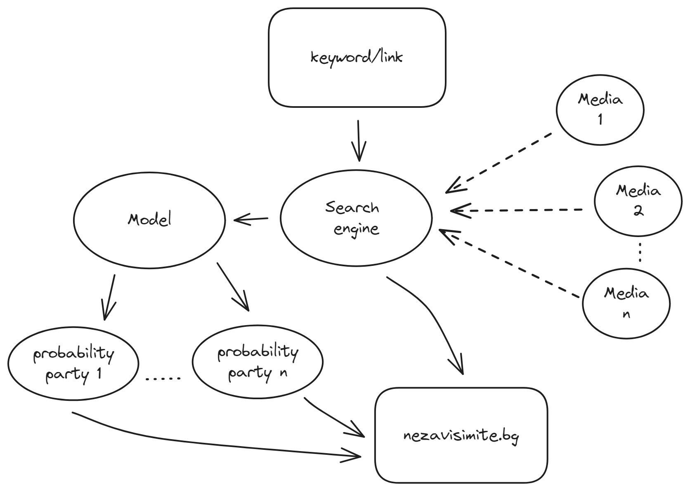
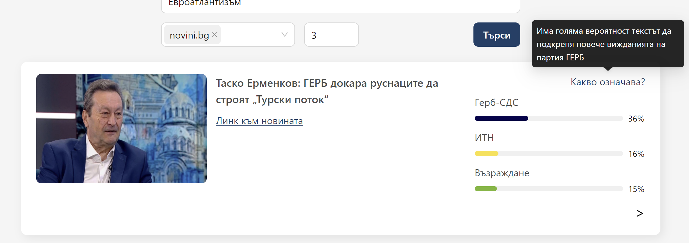

# Nezavisimi

**Независими** е платформа за търсене на новини в различни български медии, използваща езиков модел, за да определи вероятността някоя от статиите да използва речник, специфичен за дадена парламентарно представена политическа партия. Моделът е трениран с данни от официални изявления, интервюта, политически програми и публикации в социалните мрежи на ГЕРБ, Възраждане, БСП, ПП-ДБ, ДПС, ИТН. Моделът е взет от Laver, M.

**Nezavisimi** is a news searching platform that searches different Bulgarian media employing a word model to evaluate the probability that a certain news article employs a vocabulary specific for a given political party currently in the Bulgarian National Assembly. It is trained with data from official press releases, interviews, political programmes and social media publications by GERB, Vazrazhdane, BSP, PP-DB, DPS, ITN. The model is taken from Laver, M.

За тестване на модела е нужен python 3+.

 `$ cd block`
 `$ python explain.py <file>`
където file съдържа текста за изследване

### Структурна схема на платформата

### Как изглежда
 

### Bibliography/Източници:
LAVER M, BENOIT K, GARRY J. Extracting Policy Positions from Political Texts Using Words as Data. American Political Science Review. 2003;97(2):311-331. doi:10.1017/S0003055403000698